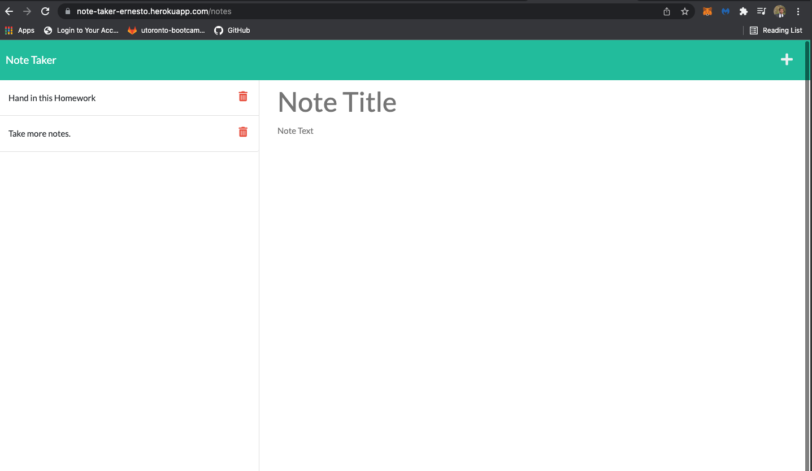

# Ernesto-Note-Taker

[](https://opensource.org/licences/MIT)

## Description

This application is called Ernesto Note Taker and can be used to write and save notes. This application uses an Express.js back end and will save and retrieve note data from a JSON file. This application will be hosted by Heroku and can be accessed from any device with the url.

## Table of Contents

-   [User Story](#userstory)
-   [Demo Video](#demovideo)
-   [Screen Shots](#screenshots)
-   [Installation](#installation)
-   [Usage](#usage)
-   [License](#license)
-   [Contributing](#contributing)
-   [Tests](#tests)
-   [Questions](#questions)

## User Story

AS a small business owner I WANT to be able to write and save notes SO THAT i can organize my thoughts and keep track of tasks i need to complete.

## Demo Video

https://drive.google.com/file/d/1nwRpOEP8FjQY27hikZ4N0cGWoJm5jNW1/view?usp=sharing

## Screenshots



## Installation

This project uses 2 npm packages:

-   [axios](https://www.npmjs.com/package/axios)
    To install necessary dependencies, run the following command:

```
npm install
```

```
npm install html-pdf
```

## Usage

To run tests, run the following command:

```
node index.js
```

## License

    License is MIT standard license.

## Contributing

It is an open project and everyone can contribute - please send and email requesting to be added as a contributor

## Tests

There is no testing required

## Questions

If you have any questions about the repo, open an issue or contact [ernestosanchezCS](https://github.com/ernestosanchezCS/) directly at ernestosanchez8888@gmail.com.
